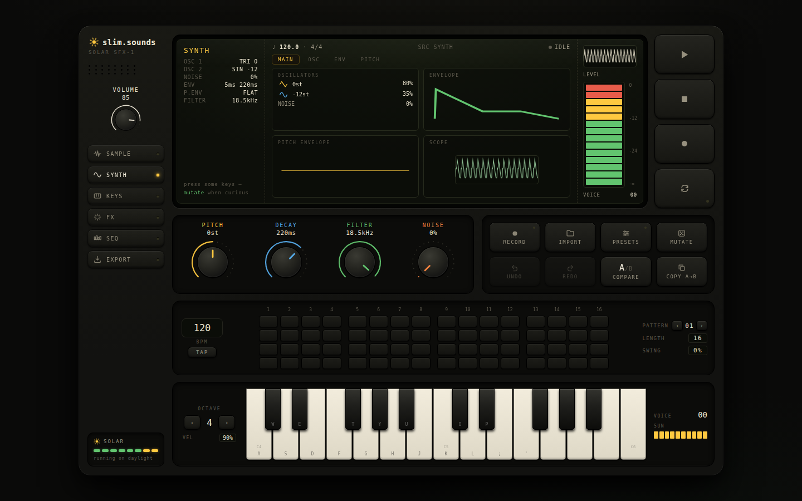
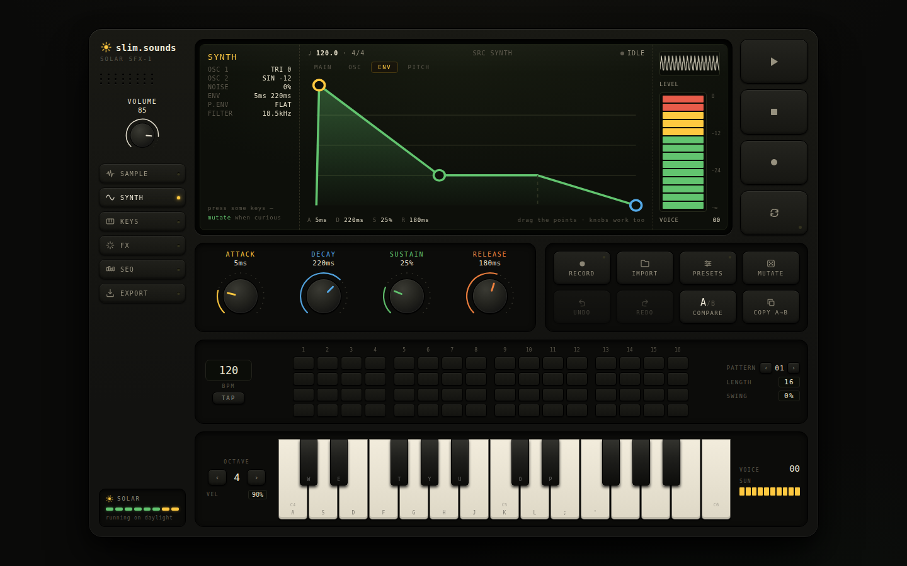

# slim.sounds · SOLAR SFX-1

An online soundmaker for video game sfx — a solar-punk hardware instrument that lives in your browser.



**slim.sounds** is not a DAW. It's a focused sound-design instrument for game audio, built around one loop:

```
RECORD SOMETHING → TWIST IT → PLAY IT → MAKE IT WEIRD → EXPORT WAV
```

Record a "clack" and turn it into a futuristic UI click. Hit a mug and make it a sci-fi impact. Or start from an oscillator and sculpt a laser, a coin, a jump, a solar charge.

## Running it

```bash
npm install
npm run dev      # local dev server
npm run build    # type-check + production build (dist/)
```

Everything runs client-side on the Web Audio API — no backend, no accounts, no uploads.

## The instrument

- **SAMPLE** — record from the mic, drop in audio files (WAV/MP3/OGG/M4A…), then trim, crop, zoom, reverse, normalize, fade, re-pitch and re-speed on a tactile waveform editor.
- **SYNTH** — two oscillators (sine/tri/saw/square) + noise, a draggable ADSR envelope, and a dedicated **pitch envelope** (the secret to zaps, falls, rises and power-ups).
- **KEYS** — your laptop keyboard is the instrument. Fully remappable: click a key, assign any note (or just press a key, then tap a piano key to bind it). Layouts save to local storage.
- **FX** — filter → drive → bitcrusher → chorus → delay → reverb → EQ. Pick a block; the four knobs shape it.
- **SEQ** — a 16-step, 4-row sequencer where each row fires the current sound at its own pitch offset. Coins, arps, alarms, machines. Four patterns, swing, gate, tap tempo.
- **EXPORT** — one button, one game-ready file: WAV 16/24-bit, 44.1/48 kHz, mono/stereo, optional normalize, editable filename. Renders offline through the full FX chain and trims the tail.

Plus: **presets** (starting points across UI / movement / combat / gameplay / solarpunk), **MUTATE** (smart randomization within sensible ranges), **undo/redo**, **A/B compare**, and a little solar meter that charges off the sounds you make.



## Keys & shortcuts

| Key | Action |
| --- | --- |
| `A W S E D F T G Y H U J K O L P ; '` | play notes (default layout, remappable in KEYS) |
| `space` | play / stop |
| `R` | record / stop recording (`esc` discards) |
| `M` | mutate |
| `1–6` | sample · synth · keys · fx · seq · export |
| `Z` / `X` | octave down / up |
| `⌘/ctrl Z` · `⌘/ctrl ⇧ Z` | undo · redo |
| `⇧A` / `⇧B` | switch to sound A / B |
| `⇧L` | loop toggle · `⇧E` export panel |

Knobs: drag vertically, scroll, `shift` for fine control, double-click to reset.

## Stack

React + TypeScript + Vite + Zustand + Web Audio API. No UI frameworks — the whole visual system is hand-built. Audio engine (`src/audio/`) is fully independent of the UI: voices with pitch-envelope-driven detune, a modular effects chain (shared between live playback and offline export rendering), an AudioWorklet bitcrusher, a procedural-IR reverb, and a 16/24-bit WAV encoder.

*running on daylight ☀*
